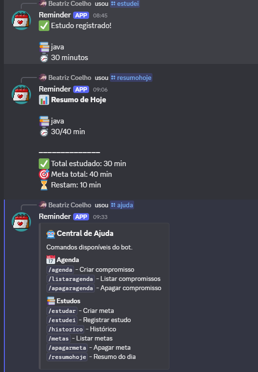

# 📚 Study Agenda Bot

Um bot para Discord desenvolvido em **Java + Spring Boot + JDA**, focado em organização e produtividade.

O bot permite gerenciar compromissos, definir metas de estudo, registrar horas estudadas e receber lembretes automáticos diretamente no Discord.

---

## ✨ Funcionalidades

### 📅 Agenda

- ✅ Criar compromissos
- ✅ Listar agenda do dia
- ✅ Apagar compromissos
- ✅ Lembretes automáticos via DM

### 📚 Estudos

- ✅ Criar metas de estudo
- ✅ Registrar tempo estudado
- ✅ Histórico de estudos
- ✅ Resumo diário
- ✅ Listagem de metas
- ✅ Remover metas

### 🤖 Discord

- ✅ Slash Commands
- ✅ Mensagens privadas (DM)
- ✅ Respostas Ephemeral
- ✅ Scheduler automático

---

# 🛠 Tecnologias

- Java 21
- Spring Boot
- Spring Data JPA
- Hibernate
- PostgreSQL
- Docker
- JDA (Java Discord API)
- Lombok

---

# 📂 Estrutura

```
src
│
├── discord
│   ├── DiscordBot
│   └── DiscordListener
│
├── model
│   ├── Agenda
│   ├── MetaEstudo
│   └── RegistroEstudo
│
├── repository
│   ├── AgendaRepository
│   ├── MetaEstudoRepository
│   └── RegistroEstudoRepository
│
├── scheduler
│   └── AgendaScheduler
│
└── service
    ├── AgendaService
    ├── MetaEstudoService
    └── RegistroEstudoService
```

---

# 🚀 Comandos

## 📅 Agenda

### Criar compromisso

```
/agenda
```

Parâmetros

- data
- hora
- título

---

### Listar agenda

```
/listaragenda
```

---

### Apagar compromisso

```
/apagaragenda
```

Parâmetro

```
id
```

---

# 📚 Estudos

## Criar meta

```
/estudar
```

Parâmetros

```
matéria
minutos
```

Exemplo

```
Java
120
```

---

## Registrar estudo

```
/estudei
```

Parâmetros

```
matéria
minutos
```

Exemplo

```
Java
45
```

---

## Histórico

```
/historico
```

Exemplo

```
📅 2026-06-30
Java
45 minutos

📅 2026-06-30
Spring
30 minutos
```

---

## Resumo do dia

```
/progresso
```

Exemplo

```
📊 Resumo de Hoje

📚 Java
60/120 min

📚 Spring
30/60 min

━━━━━━━━━━━━━━

✅ Total estudado: 90 min

🎯 Meta total: 180 min

⏳ Restam: 90 min
```

---

## Listar metas

```
/metas
```

---

## Remover meta

```
/apagarmeta
```

---

# ⏰ Scheduler

O projeto utiliza o **Spring Scheduler** para executar tarefas automáticas.

Atualmente:

- envio automático de lembretes da agenda
- envio por mensagem privada (DM)

---

# 🐳 Docker

Subir o projeto

```bash
docker compose up --build
```

Parar

```bash
docker compose down
```


---

# 📌 Próximas funcionalidades

- [ ] Pomodoro
- [ ] IA para incentivo aos estudos
- [ ] Scheduler de cobrança de metas
- [ ] Ranking de usuários
- [ ] Dashboard Web
- [ ] Exportação para CSV
- [ ] Estatísticas semanais
- [ ] Sistema de conquistas
- [ ] Streak de estudos
- [ ] Metas semanais

---

# 📷 
